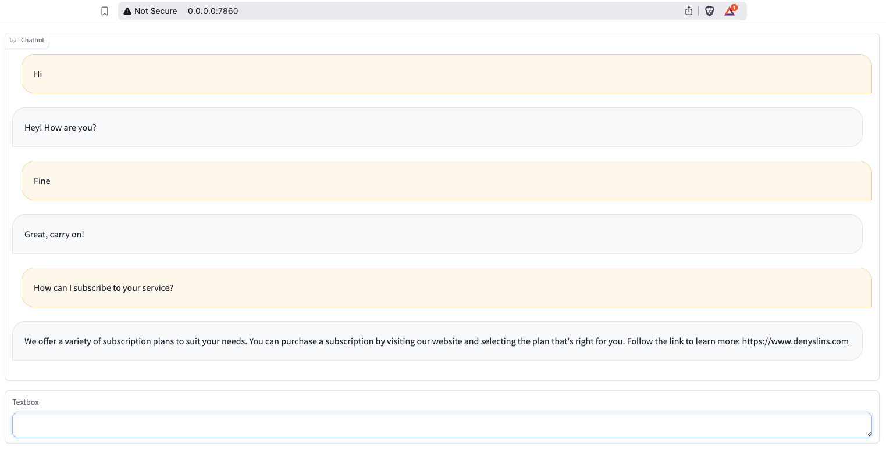

# Rasa bot with Gradio frontend

## Rasa chatbot with a Gradio frontend

This is a simple chatbot that uses Rasa for the backend and Gradio for the frontend. The chatbot is trained on a dataset
of conversations between a user and a chatbot.



### Requirements

- Python 3.10 or higher

### Installation

1. Clone the repository

 ```bash
 git clone git@github.com:DenysLins/rasa-gradio-bot.git
 ```

2. Install the dependencies

```bash
pip install -r requirements.txt
```

3. Train the Rasa model

```bash
rasa train
```

4. Run Rasa

```bash
rasa run
```

5. Run the Gradio frontend

```bash
python main.py
```

### Usage

Open a browser and navigate to `http://localhost:7860/`.

You can interact with the chatbot asking questions, and it will respond with answers based on the training data.

### License

This project is licensed under the MIT License - see the [LICENSE](LICENSE) file for details.
